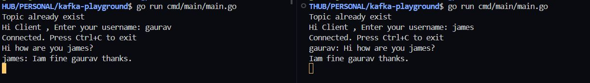

## CHAT ROOM CLI APPLICATION

This repo demonstrate a POC for a  Basic chat room application being developed using kafka as a messaging bus.

### What is a chat room application?

A chat room application is software that enables users to engage in real-time textual communication with one another. These applications typically allow multiple users to join a chat room, where they can send messages and interact with others in a group conversation.

### Library Used for Kafka Interaction: 

This is the library used to build this basic chart room application: [franz-go](https://github.com/twmb/franz-go)

### RESULT

